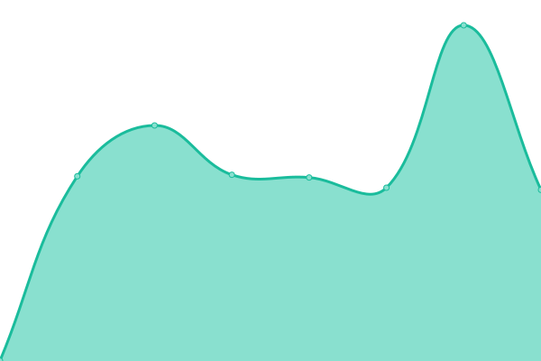
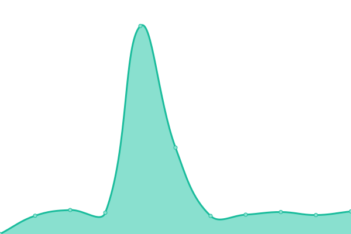
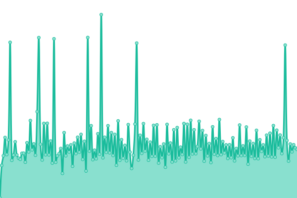
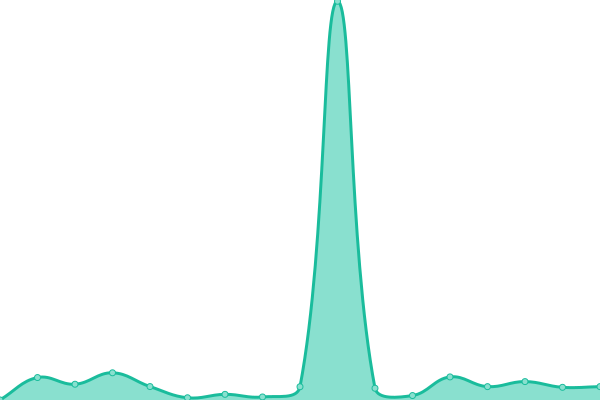
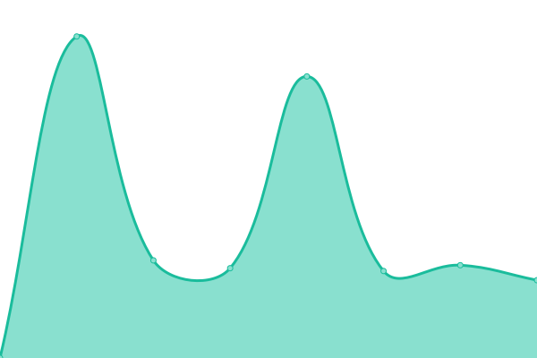

# [📈 Live Status](https://v0idxyz.github.io/uptime-status): <!--live status--> **🟥 Complete outage**

This repository contains the open-source uptime monitor and status page for [v0idxyz](https://v0idxyz.github.io/uptime-status), powered by [Upptime](https://github.com/upptime/upptime).

With [Upptime](https://upptime.js.org), you can get your own unlimited and free uptime monitor and status page, powered entirely by a GitHub repository. We use [Issues](https://github.com/v0idxyz/uptime-status/issues) as incident reports, [Actions](https://github.com/v0idxyz/uptime-status/actions) as uptime monitors, and [Pages](https://v0idxyz.github.io/uptime-status) for the status page.

<!--start: status pages-->
<!-- This summary is generated by Upptime (https://github.com/upptime/upptime) -->
<!-- Do not edit this manually, your changes will be overwritten -->
<!-- prettier-ignore -->
| URL | Status | History | Response Time | Uptime |
| --- | ------ | ------- | ------------- | ------ |
|  [TripScout](https://www.tripscout.at) | 🟥 Down | [trip-scout.yml](https://github.com/v0idxyz/uptime-status/commits/HEAD/history/trip-scout.yml) | 

 0ms
     
 | 

<a href="https://v0idxyz.github.io/uptime-status/history/trip-scout">0.00%</a>
    

|  [Miner-Sim](https://miner-sim.com) | 🟥 Down | [miner-sim.yml](https://github.com/v0idxyz/uptime-status/commits/HEAD/history/miner-sim.yml) | 

 0ms
     
 | 

<a href="https://v0idxyz.github.io/uptime-status/history/miner-sim">0.00%</a>
    

|  [Hostratgeber](https://hostratgeber.de) | 🟥 Down | [hostratgeber.yml](https://github.com/v0idxyz/uptime-status/commits/HEAD/history/hostratgeber.yml) | 

 738ms
     
 | 

<a href="https://v0idxyz.github.io/uptime-status/history/hostratgeber">68.47%</a>
    

|  [Faucettalk](https://www.faucettalk.com/) | 🟥 Down | [faucettalk.yml](https://github.com/v0idxyz/uptime-status/commits/HEAD/history/faucettalk.yml) | 

 0ms
     
 | 

<a href="https://v0idxyz.github.io/uptime-status/history/faucettalk">0.00%</a>
    

|  [Lamien](https://lamien.at) | 🟥 Down | [lamien.yml](https://github.com/v0idxyz/uptime-status/commits/HEAD/history/lamien.yml) | 

 0ms
     
 | 

<a href="https://v0idxyz.github.io/uptime-status/history/lamien">0.00%</a>
    

|  [c2g](https://c2g.at/) | 🟥 Down | [c2g.yml](https://github.com/v0idxyz/uptime-status/commits/HEAD/history/c2g.yml) | 

 1280ms
     
 | 

<a href="https://v0idxyz.github.io/uptime-status/history/c2g">68.47%</a>
    

|  [cryptraffic.de](https://cryptraffic.de/) | 🟥 Down | [cryptraffic-de.yml](https://github.com/v0idxyz/uptime-status/commits/HEAD/history/cryptraffic-de.yml) | 

 483ms
     
 | 

<a href="https://v0idxyz.github.io/uptime-status/history/cryptraffic-de">95.75%</a>
    

|  [EP.org](https://encyclopedia-piratica.org/) | 🟥 Down | [ep-org.yml](https://github.com/v0idxyz/uptime-status/commits/HEAD/history/ep-org.yml) | 

 0ms
     
 | 

<a href="https://v0idxyz.github.io/uptime-status/history/ep-org">0.00%</a>
    

|  [FuckedDB.club](https://fuckeddb.club/) | 🟥 Down | [fucked-db-club.yml](https://github.com/v0idxyz/uptime-status/commits/HEAD/history/fucked-db-club.yml) | 

 0ms
     
 | 

<a href="https://v0idxyz.github.io/uptime-status/history/fucked-db-club">0.00%</a>
    

|  [Hydra Media](https://hydra-media.eu) | 🟥 Down | [hydra-media.yml](https://github.com/v0idxyz/uptime-status/commits/HEAD/history/hydra-media.yml) | 

 0ms
     
 | 

<a href="https://v0idxyz.github.io/uptime-status/history/hydra-media">0.00%</a>
    

|  [Webadtopia](https://webadtopia.com/) | 🟥 Down | [webadtopia.yml](https://github.com/v0idxyz/uptime-status/commits/HEAD/history/webadtopia.yml) | 

 0ms
     
 | 

<a href="https://v0idxyz.github.io/uptime-status/history/webadtopia">0.00%</a>
    

|  [Mineable Coins](http://mineable-coins.net/) | 🟥 Down | [mineable-coins.yml](https://github.com/v0idxyz/uptime-status/commits/HEAD/history/mineable-coins.yml) | 

 0ms
     
 | 

<a href="https://v0idxyz.github.io/uptime-status/history/mineable-coins">0.00%</a>
    

|  [123file](https://123file.li/) | 🟥 Down | [123file.yml](https://github.com/v0idxyz/uptime-status/commits/HEAD/history/123file.yml) | 

 0ms
     
 | 

<a href="https://v0idxyz.github.io/uptime-status/history/123file">0.00%</a>
    

|  [v0id.name](https://v0id.name/) | 🟥 Down | [v0id-name.yml](https://github.com/v0idxyz/uptime-status/commits/HEAD/history/v0id-name.yml) | 

 0ms
     
 | 

<a href="https://v0idxyz.github.io/uptime-status/history/v0id-name">0.00%</a>
    

<!--end: status pages-->

[**Visit our status website →**](https://v0idxyz.github.io/uptime-status)

## 📄 License

- Powered by: [Upptime](https://github.com/upptime/upptime)
- Code: [MIT](./LICENSE) © [v0idxyz](https://v0idxyz.github.io/uptime-status)
- Data in the `./history` directory: [Open Database License](https://opendatacommons.org/licenses/odbl/1-0/)
